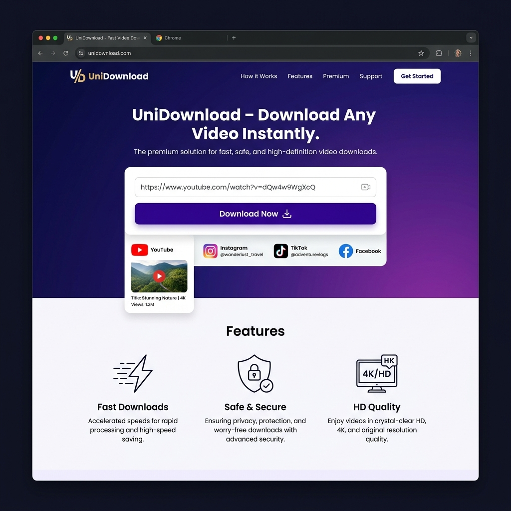

# 🚀 UniDownload - Premium Video Downloader

UniDownload is a powerful, professional, and high-speed video downloader built with **React**, **Node.js**, and **yt-dlp**. It allows users to save videos from YouTube, Instagram, Facebook, TikTok, and more—all in HD quality and without watermarks.



## ✨ Features

- **Multi-Platform Support**: YouTube, Instagram, Facebook, TikTok, Twitter (X), and more.
- **Multiple Quality Options**: Choose between 4K, 1080p, 720p, 480p, or Audio-only (MP3).
- **Real-time Progress**: Live WebSocket-based progress bar for every download.
- **Privacy First**: No login required. Files are deleted from the server immediately after download.
- **Production Ready**: Full Docker & Nginx configuration included for easy deployment.
- **Responsive Design**: Modern, glassmorphism UI that looks great on mobile and desktop.

---

## 🛠️ Technology Stack

- **Frontend**: React 19, Vite, Tailwind CSS 4, React Router 7.
- **Backend**: Node.js, Express, WebSockets (ws).
- **Core Engine**: yt-dlp (Python-based).
- **Infrastructure**: Docker, Docker Compose, Nginx.

---

## 🚀 Quick Start (Production with Docker)

The easiest way to run UniDownload in a production-like environment is using Docker Compose.

1. **Clone the repository**
   ```bash
   git clone <your-repo-url>
   cd unidownload
   ```

2. **Start the containers**
   ```bash
   docker-compose up --build -d
   ```

3. **Access the app**
   Open your browser and go to: `http://localhost`

---

## 💻 Local Development

If you want to run the application locally without Docker:

### 1. Prerequisite
- Node.js 20+
- Python 3.9+ 
- FFmpeg installed in your system (required for merging high-quality video/audio).

### 2. Setup Server
```bash
cd server
npm install
# Ensure yt-dlp.py is present or yt-dlp is installed via pip
npm run dev
```

### 3. Setup Client
```bash
cd client
npm install
npm run dev
```

The client will be available at `http://localhost:5173`.

---

## 📦 Project Structure

```text
├── client/              # React frontend
│   ├── src/             # Source code (Components, Pages)
│   ├── public/          # Static assets (Home-page.png)
│   ├── Dockerfile       # Multi-stage production build
│   └── nginx.conf       # Nginx routing & proxy config
├── server/              # Node.js backend
│   ├── temp/            # Temporary download storage
│   ├── Dockerfile       # Node.js + Python + FFmpeg environment
│   └── server.js        # Express & WebSocket logic
└── docker-compose.yml   # Full stack orchestration
```

---

## ⚖️ Legal & Privacy

UniDownload is for personal, lawful use only. Users are responsible for complying with the copyright laws and terms of service of the platforms they download from.

- [Privacy Policy](http://localhost/privacy)
- [Terms of Service](http://localhost/terms)
- [Cookie Policy](http://localhost/cookies)

---

## 👨‍💻 Author

**Muhammad Khalil** - [GitHub](https://github.com/Khalil-deve)

---

License: ISC
